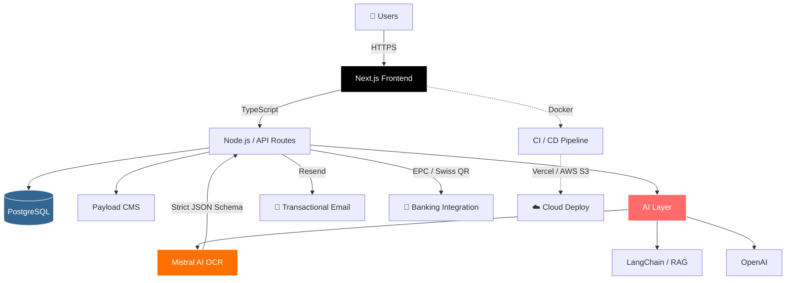

<div align="center">


<br/>

<a href="https://www.linkedin.com/in/rajan-ravisaheb/"></a>
<a href="mailto:rajanr1707@gmail.com"></a>
<a href="https://github.com/RajanR21"></a>

</div>


## <picture><source media="(prefers-color-scheme: dark)" srcset="https://fonts.gstatic.com/s/e/notoemoji/latest/1f44b/512.gif"></picture> About Me

```typescript
const rajan: Developer = {
  name:       "Rajan Ravisaheb",
  location:   "Rosenheim, Bavaria 🇩🇪",
  currentRole: "Werkstudent SWE @ Nice Solutions GmbH",
  education:  "M.Eng. Electrical Engineering & IT — TH Rosenheim (2025–present)",
  certification: "ML for Engineers I — FAU Erlangen-Nürnberg · Grade 1.3 · 5 ECTS",

  shippingNow: ["AI document pipelines", "Multi-tenant SaaS", "LLM + RAG production systems"],
  toolbelt:    ["TypeScript", "Next.js", "Node.js", "Payload CMS", "Mistral AI", "PostgreSQL", "Docker"],

  languages: {
    code: ["TypeScript", "JavaScript", "Python", "C/C++", "SQL"],
    human: { english: "fluent 🇬🇧", german: "B1 → B2 🇩🇪", hindi: "native 🇮🇳", gujarati: "native" }
  },

  funFact: "I treat debugging and boss fights the same way: pattern recognition + patience 🎮",
  superPower: "Turning fuzzy LLM output into clean schema-validated JSON 🤖",
};
```


##  What I'm Building Right Now

<table>
<tr>
<td width="60%">

🚀 **Production AI systems** at Nice Solutions GmbH — Mistral OCR with strict TypeScript schema validation, React-PDF rendered output, secure expiring share URLs

🧠 **Multi-tenant SaaS** with EPC (EUR) + Swiss QR (CHF) banking integration, live across Germany & Switzerland

📚 **M.Eng. in Electrical Engineering & IT** at TH Rosenheim — currently 3rd semester

🎯 **Open to Werkstudent roles** in Rosenheim/Munich area starting June 2026

</td>
<td width="40%">


**Currently learning**


</td>
</tr>
</table>


##  Tech Stack Architecture

How my daily stack actually fits together:



### ⬡ Languages & Frameworks

<div align="center">

[](https://skillicons.dev)

[](https://skillicons.dev)

</div>

### ⬡ Databases · Cloud · DevOps

<div align="center">

[](https://skillicons.dev)

[](https://skillicons.dev)

</div>

### ⬡ AI · ML · Data

<div align="center">

[](https://skillicons.dev)


</div>


##  GitHub Metrics

<div align="center">


</div>

> *The metrics panel above is generated automatically by [lowlighter/metrics](https://github.com/lowlighter/metrics) — see the setup guide for the GitHub Action.*

<div align="center">


</div>

<div align="center">


</div>

### Profile Summary Cards

<div align="center">


</div>

### 3D Contribution Calendar

<div align="center">


</div>


##  Trophies

<div align="center">


</div>


##  Featured Projects

<div align="center">

<a href="https://github.com/RajanR21/Book-My-Journey">

</a>
<a href="https://github.com/RajanR21/EManager">

</a>

</div>

<div align="center">

<a href="https://github.com/RajanR21/Crypto_Bit">

</a>

</div>

### 🔒 Production Work · Nice Solutions GmbH

<div align="center">

| Project | Stack | Live |
|---|---|---|
| 🤖 **AI Document Parsing Pipeline** | TypeScript · Mistral AI · React-PDF · Zod | Internal |
| 💝 **Multi-tenant Donation SaaS** | Next.js · Payload CMS · PostgreSQL · Resend | [lomigo-platform-v3.vercel.app](https://lomigo-platform-v3.vercel.app) |
| 🩺 **Healthcare Information Portal** | Next.js · Payload CMS · Bun | [lieber-zu-hause.eu](https://lieber-zu-hause.eu) |
| 📖 **AI Storytelling Platform** | TypeScript · Node.js · LLM Integration | Internal |

</div>


##  Education & Certifications

<table>
<tr>
<td>🎓</td>
<td><b>M.Eng. Electrical Engineering & IT</b><br/><i>Technische Hochschule Rosenheim</i> · March 2025 – present</td>
</tr>
<tr>
<td>📜</td>
<td><b>Machine Learning for Engineers I</b> — Grade <b>1.3</b> · 5 ECTS<br/><i>Friedrich-Alexander-Universität Erlangen-Nürnberg</i> · WS 2025</td>
</tr>
<tr>
<td>🎓</td>
<td><b>B.E. Electronics & Communication Engineering</b><br/><i>Dharmsinh Desai University</i> · 2020 – 2024</td>
</tr>
<tr>
<td>🔐</td>
<td><b>Research:</b> Novel (k, n) Threshold Secret-Sharing Scheme for Visual Cryptography <i>(DDU)</i></td>
</tr>
</table>


##  Activity & Contributions

<div align="center">


</div>

### 🐍 Contribution Snake

<div align="center">

<picture>
  <source media="(prefers-color-scheme: dark)" srcset="https://raw.githubusercontent.com/RajanR21/RajanR21/output/github-contribution-grid-snake-dark.svg"/>
  <source media="(prefers-color-scheme: light)" srcset="https://raw.githubusercontent.com/RajanR21/RajanR21/output/github-contribution-grid-snake.svg"/>
  
</picture>

</div>


##  Quote of the Day

<div align="center">


</div>


##  Let's Connect

<div align="center">


<br/><br/>

<a href="https://www.linkedin.com/in/rajan-ravisaheb/"></a>
<a href="https://leetcode.com/u/Rajan_R/"></a>
<a href="mailto:rajanr1707@gmail.com"></a>
<a href="https://github.com/RajanR21"></a>

</div>

<br/>

<div align="center">

⭐ **Thanks for stopping by!** If you find my work interesting, consider leaving a star on any repo that caught your eye.

</div>


